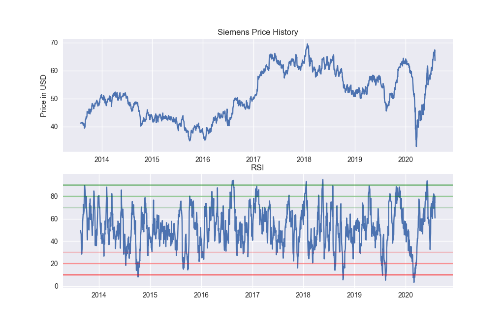

# Technical analysis

## General info
Example of a technical analysis using Python. \
Technical analysis is a method of analyzing stock prices on the basis of statistical data - chart patterns, trends, volume, moving averages. 

The Relative Strength Index (RSI) is an indicator that measures price movements and evaluates if stock was overbought or oversold.

\
Code inspired by YouTube channel “Computer Science” \
(https://www.youtube.com/watch?v=fxLsSax7rvY&t=392s). \
\
Data source: https://finance.yahoo.com

## Table of contents
* [Screenshot](#screenshots)
* [Setup](#setup)
* [Usage](#usage)
* [Owner](#owner)
* [License](#license)

## Screenshot


## Setup
### Clone the source:

```shell
$ git clone https://github.com/milenakowalska/Technical_analysis
$ cd Technical_analysis
```
### Install packages

```shell
$ pip3 install -r requirements.txt
```
### Run the program

```shell
$ python3 technical_analysis.py
```

## Usage
Run program to see the plot representing Siemens closing price from 2013-08-02 to 2020-07-31 and the plot which illustrates Relative Strength Index. \
When the RSI line goes below 20, stock was oversold.
When it goes above 80, stock was overbought.

## Owner
Created by milenakowalska.

## License
[](http://badges.mit-license.org)

- **[MIT license](http://opensource.org/licenses/mit-license.php)**
